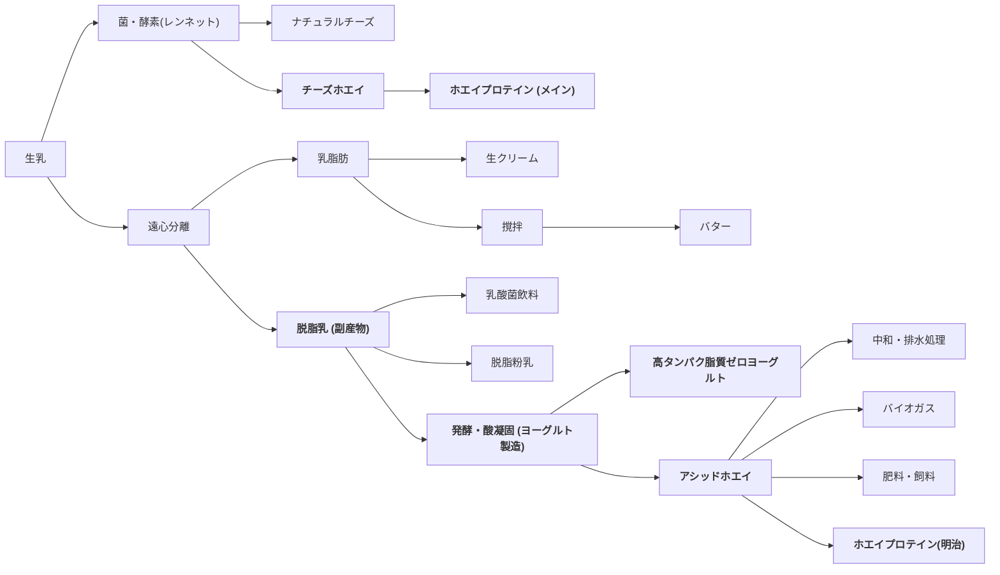
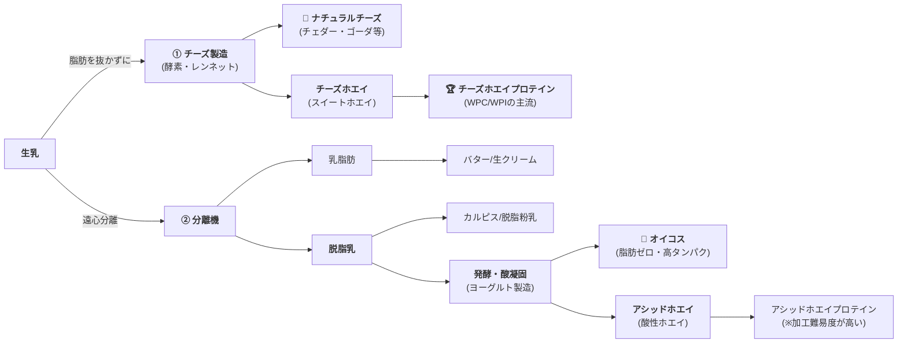
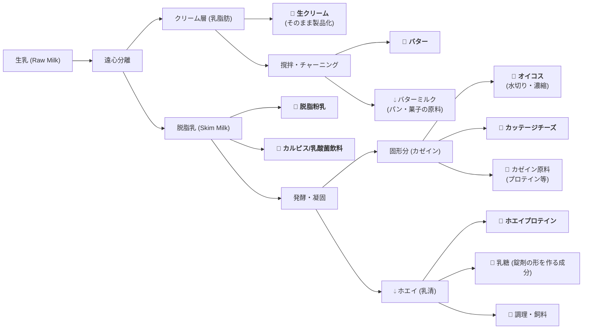

```mermaid
graph LR
Milk["生乳"]
%% === ルート1: チーズ製造（生乳を使用） ===
Milk --> CheeseProcess["菌・酵素(レンネット)"]
CheeseProcess --> Cheese["ナチュラルチーズ"]
CheeseProcess --> SweetWhey["<b>チーズホエイ</b>"]
SweetWhey --> MainPro["<b>ホエイプロテイン (メイン)</b>"]
%% === ルート2: 分離・脱脂（脱脂乳を使用） ===
Milk --> Separator["遠心分離"]
%% --- クリーム側の流れ ---
Separator --> Cream["乳脂肪"]
Cream --> Creamy["生クリーム"]
Cream --> ButterProcess["撹拌"]
ButterProcess --> Butter["バター"]
%% --- 脱脂乳側の流れ ---
Separator --> SkimMilk["<b>脱脂乳 (副産物)</b>"]
%% そのまま加工
SkimMilk --> Calpis["乳酸菌飲料"]
SkimMilk --> Powder["脱脂粉乳"]
%% 発酵プロセスへ（酸で固める）
SkimMilk --> Ferment["<b>発酵・酸凝固 (ヨーグルト製造)</b>"]
%% 固形分（カゼイン）
Ferment --> Oikos["<b>高タンパク脂質ゼロヨーグルト</b>"]
%% 液体（ホエイ）
Ferment --> AcidWhey["<b>アシッドホエイ<b>"]
AcidWhey --> main["中和・排水処理"]
AcidWhey --> sub["バイオガス"]
AcidWhey --> limit["肥料・飼料"]
AcidWhey --> RarePro["<b>ホエイプロテイン(明治)</b>"]
```

```mermaid
graph LR
    %% ノード定義 (特殊文字によるエラー回避のため引用符を使用)
    Intro["1. INTRODUCTION (導入)<br>プラスミドの概要"]
    
    subgraph Molecular_Mechanisms [分子メカニズム]
        direction LR
        Init["2. REPLICATION INITIATION<br>(複製起点での開始)"]
        Mech["3. MECHANISMS<br>(複製のメカニズム)"]
    end

    subgraph System_Regulation [分類と制御]
        direction LR
        Class["4. CLASSIFICATION<br>(配列に基づく分類)"]
        Reg["5. REGULATION<br>(複製の制御)"]
    end

    subgraph Context [生物学的・進化的文脈]
        direction LR
        Host["6. HOST RANGE<br>(宿主域)"]
        Maint["7. MAINTENANCE<br>(維持機構)"]
        Cluster["8. CLUSTERING<br>(因子のクラスター化)"]
    end

    Concl["9. CONCLUDING REMARKS<br>(結論)"]

    %% 接続フロー
    Intro --> Init
    Init --> Mech
    Mech --> Class
    Class --> Reg
    Reg --> Host
    Host --> Maint
    Maint --> Cluster
    Cluster --> Concl

    %% スタイル設定
    style Intro fill:#f9f9f9,stroke:#333,stroke-width:2px
    style Concl fill:#f9f9f9,stroke:#333,stroke-width:2px
    style Molecular_Mechanisms fill:#e1f5fe,stroke:#01579b
    style System_Regulation fill:#fff9c4,stroke:#fbc02d
    style Context fill:#e8f5e9,stroke:#2e7d32
```

```mermaid
graph LR
    Milk["<b>生乳</b>"]

    %% === ルート1: チーズ製造（全乳を使うメインルート） ===
    Milk -->|脂肪を抜かずに| CheeseProcess["<b>① チーズ製造</b><br>(酵素・レンネット)"]
    CheeseProcess --> Cheese["<b>🧀 ナチュラルチーズ</b><br>(チェダー・ゴーダ等)"]
    CheeseProcess --> SweetWhey["<b>チーズホエイ</b><br>(スイートホエイ)"]
    SweetWhey --> SweetPro["<b>🏆 チーズホエイプロテイン</b><br>(WPC/WPIの主流)"]

    %% === ルート2: 分離・脱脂（バター・脱脂乳ルート） ===
    Milk -->|遠心分離| Separator["<b>② 分離機</b>"]
    %% クリーム側
    Separator --> Cream["乳脂肪"]
    Cream --> Butter["バター/生クリーム"]
    %% 脱脂乳側
    Separator --> SkimMilk["<b>脱脂乳</b>"]
    %% 脱脂乳の活用
    SkimMilk --> Calpis["カルピス/脱脂粉乳"]
    %% オイコス（ヨーグルト）
    SkimMilk --> YogurtProcess["<b>発酵・酸凝固</b><br>(ヨーグルト製造)"]
    YogurtProcess --> Oikos["<b>🥣 オイコス</b><br>(脂肪ゼロ・高タンパク)"]
    YogurtProcess --> AcidWhey["<b>アシッドホエイ</b><br>(酸性ホエイ)"]
    AcidWhey --> AcidPro["アシッドホエイプロテイン<br>(※加工難易度が高い)"]
```

```mermaid
graph LR
Milk["生乳 (Raw Milk)"]-->Separator["遠心分離"]
%% --- 脂肪分（クリーム層）の流れ ---
Separator-->Cream["クリーム層 (乳脂肪)"]
Cream-->FreshCream["<b>🍰 生クリーム</b><br>(そのまま製品化)"]
Cream-->ButterProcess["撹拌・チャーニング"]
ButterProcess-->Butter["<b>🧈 バター</b>"]
ButterProcess-->Buttermilk["💧 バターミルク<br>(パン・菓子の原料)"]
%% --- 脱脂分（脱脂乳）の流れ ---
Separator-->SkimMilk["脱脂乳 (Skim Milk)"]
SkimMilk-->Powder["<b>🥛 脱脂粉乳</b>"]
SkimMilk-->Calpis["<b>🥤 カルピス/乳酸菌飲料</b>"]
%% 発酵・凝固
SkimMilk-->Ferment["発酵・凝固"]
%% 固形分
Ferment-->Curd["固形分 (カゼイン)"]
Curd-->Oikos["<b>🥣 オイコス</b><br>(水切り・濃縮)"]
Curd-->Cottage["<b>🥗 カッテージチーズ</b>"]
Curd-->IndCasein["💊 カゼイン原料<br>(プロテイン等)"]
%% 液体
Ferment-->Whey["💧 ホエイ (乳清)"]
Whey-->WPC_WPI["<b>💪 ホエイプロテイン</b>"]
Whey-->Lactose["💊 乳糖 (錠剤の形を作る成分)"]
Whey-->Cooking["🍳 調理・飼料"]
```
