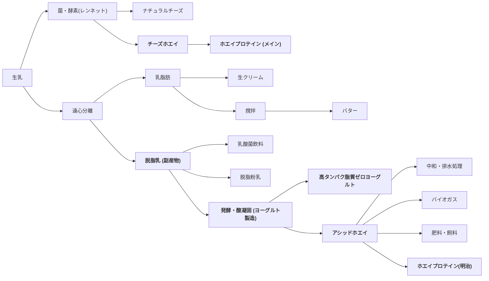
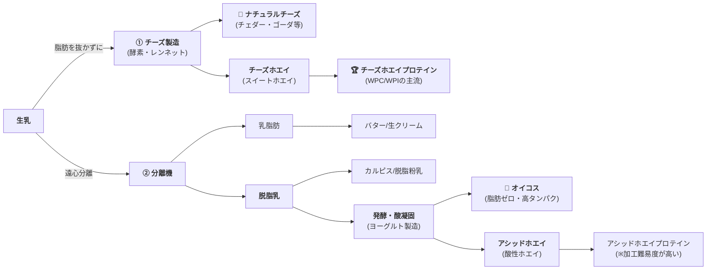
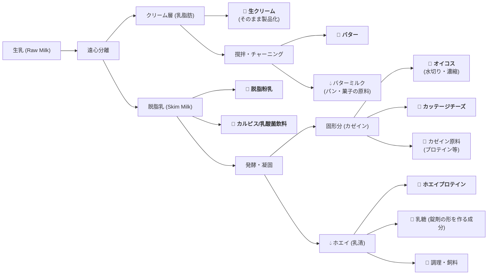

```mermaid
graph LR
%% ノードの定義
Intro[<b>1. INTRODUCTION (導入)</b><br>プラスミドの概要と本総説の目的]
    
subgraph Molecular_Mechanisms [分子メカニズムの解明]
direction LR
Init[<b>2. PLASMID REPLICATION INITIATION<br>AT ORIGINS OF REPLICATION</b><br>複製起点での開始<br><small>ori構造、Repタンパク質の役割</small>]
Mech[<b>3. MECHANISMS OF PLASMID REPLICATION</b><br>複製のメカニズム<br><small>シータ型複製、DnaA/PriA依存経路</small>]
end

subgraph System_Regulation [分類と制御システム]
direction LR
Class[<b>4. SEQUENCE-BASED CLASSIFICATION<br>OF PLASMID REPLICONS</b><br>配列に基づくレプリコンの分類<br><small>類似性によるグループ化</small>]
Reg[<b>5. REGULATION OF PLASMID REPLICATION</b><br>複製の制御<br><small>コピー数制御、アンチセンスRNA、イテロン</small>]
end

subgraph Eco_Evo_Context [生物学的・進化的文脈]
 direction LR
Host[<b>6. BROADER BIOLOGICAL CONTEXT:<br>HOST RANGE</b><br>宿主域<br><small>広宿主域 vs 狭宿主域、適応コスト</small>]
        Maint[<b>7. BROADER BIOLOGICAL CONTEXT:<br>PLASMID MAINTENANCE</b><br>プラスミドの維持<br><small>分配システム(Par)、トキシン-アンチトキシン系</small>]
        Cluster[<b>8. CLUSTERING OF<br>PLASMID MAINTENANCE ELEMENTS</b><br>維持エレメントのクラスター化<br><small>複製・維持遺伝子の物理的近接と共進化</small>]
end

Concl[<b>9. CONCLUDING REMARKS (結論)</b><br>総括と今後の展望]

%% フローの接続
Intro --> Init
Init --> Mech
Mech --> Class
Class --> Reg
Reg --> Host
Host --> Maint
Maint --> Cluster
Cluster --> Concl

%% スタイル調整
style Intro fill:#f9f9f9,stroke:#333,stroke-width:2px
style Concl fill:#f9f9f9,stroke:#333,stroke-width:2px
style Molecular_Mechanisms fill:#e1f5fe,stroke:#01579b
style System_Regulation fill:#fff9c4,stroke:#fbc02d
style Eco_Evo_Context fill:#e8f5e9,stroke:#2e7d32
```





