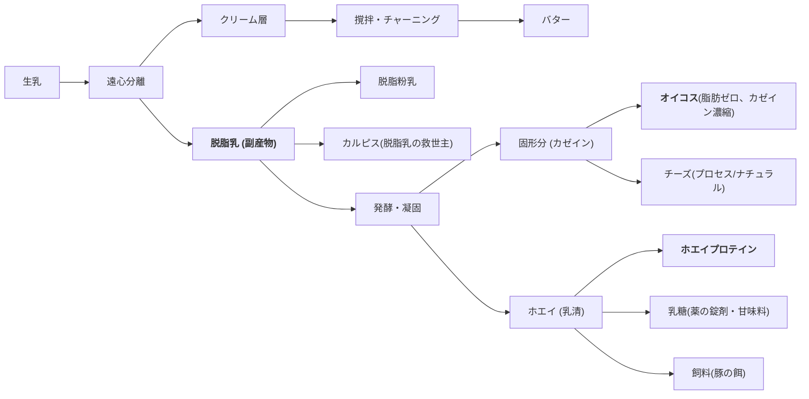

```mermaid
graph LR
Milk["生乳"]-->Separator["遠心分離"]
%% --- クリーム側の流れ ---
Separator-->Cream["クリーム層"]
Cream-->ButterProcess["撹拌・チャーニング"]
ButterProcess-->Butter["バター"]
%% --- 脱脂乳側の流れ ---
Separator-->SkimMilk["<b>脱脂乳 (副産物)</b>"]
%% そのまま加工
SkimMilk-->Powder["脱脂粉乳"]
SkimMilk-->Calpis["カルピス(脱脂乳の救世主)"]
%% 発酵プロセスへ
SkimMilk-->Ferment["発酵・凝固"]
%% 固形分（カゼイン）の行方
Ferment-->Curd["固形分 (カゼイン)"]
Curd-->Oikos["<b>オイコス</b>(脂肪ゼロ、カゼイン濃縮)"]
Curd-->Cheese["チーズ(プロセス/ナチュラル)"]
%% 液体（ホエイ）の行方
Ferment-->Whey["ホエイ (乳清)"]
Whey-->WPC_WPI["<b>ホエイプロテイン</b>"]
Whey-->Lactose["乳糖(薬の錠剤・甘味料)"]
Whey-->Cooking["飼料(豚の餌)"]
```
<b></b>
