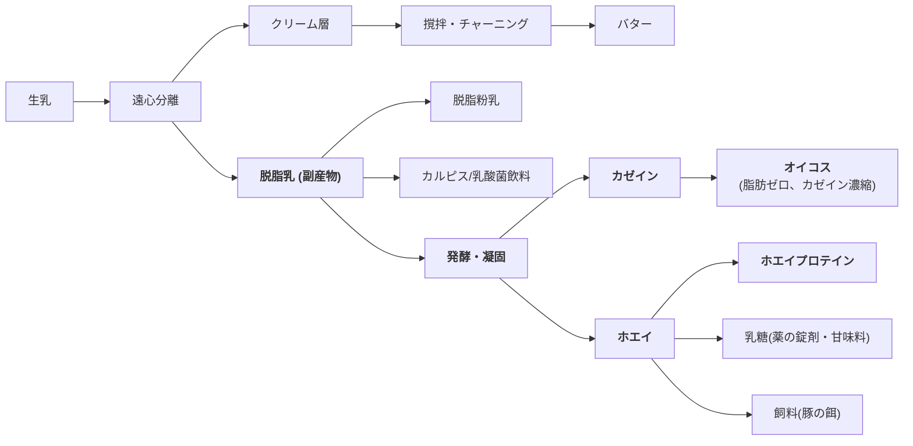
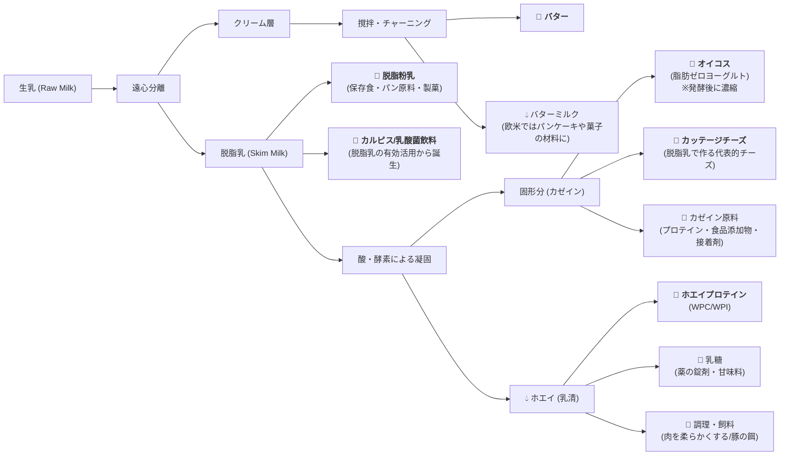

```mermaid
graph LR
Milk["生乳"]-->Separator["遠心分離"]
%% --- クリーム側の流れ ---
Separator-->Cream["クリーム層"]
Cream-->ButterProcess["撹拌・チャーニング"]
ButterProcess-->Butter["バター"]
%% --- 脱脂乳側の流れ ---
Separator-->SkimMilk["<b>脱脂乳 (副産物)</b>"]
%% そのまま加工
SkimMilk-->Powder["脱脂粉乳"]
SkimMilk-->Calpis["カルピス/乳酸菌飲料"]
%% 発酵プロセスへ
SkimMilk-->Ferment["<b>発酵・凝固</b>"]
%% 固形分（カゼイン）の行方
Ferment-->Curd["<b>カゼイン</b>"]
Curd-->Oikos["<b>オイコス</b><br>(脂肪ゼロ、カゼイン濃縮)"]
%% 液体（ホエイ）の行方
Ferment-->Whey["<b>ホエイ</b>"]
Whey-->WPC_WPI["<b>ホエイプロテイン</b>"]
Whey-->Lactose["乳糖(薬の錠剤・甘味料)"]
Whey-->Cooking["飼料(豚の餌)"]
```
<b></b>

```mermaid
graph LR
Milk["生乳 (Raw Milk)"]-->Separator["遠心分離"]
%% --- クリーム側の流れ ---
Separator-->Cream["クリーム層"]
Cream-->ButterProcess["撹拌・チャーニング"]
ButterProcess-->Butter["<b>🧈 バター</b>"]
ButterProcess-->Buttermilk["💧 バターミルク<br>(欧米ではパンケーキや菓子の材料に)"]
%% --- 脱脂乳側の流れ ---
Separator-->SkimMilk["脱脂乳 (Skim Milk)"]
%% そのまま加工
SkimMilk-->Powder["<b>🥛 脱脂粉乳</b><br>(保存食・パン原料・製菓)"]
SkimMilk-->Calpis["<b>🥤 カルピス/乳酸菌飲料</b><br>(脱脂乳の有効活用から誕生)"]
%% 酸・酵素で凝固させる
SkimMilk-->Coagulation["酸・酵素による凝固"]
%% 固形分（カゼイン）の行方
Coagulation-->Curd["固形分 (カゼイン)"]
Curd-->Oikos["<b>🥣 オイコス</b><br>(脂肪ゼロヨーグルト)<br>※発酵後に濃縮"]
Curd-->Cottage["<b>🥗 カッテージチーズ</b><br>(脱脂乳で作る代表的チーズ)"]
Curd-->IndCasein["💊 カゼイン原料<br>(プロテイン・食品添加物・接着剤)"]
%% 液体（ホエイ）の行方
Coagulation-->Whey["💧 ホエイ (乳清)"]
Whey-->WPC_WPI["<b>💪 ホエイプロテイン</b><br>(WPC/WPI)"]
Whey-->Lactose["💊 乳糖<br>(薬の錠剤・甘味料)"]
Whey-->Cooking["🍳 調理・飼料<br>(肉を柔らかくする/豚の餌)"]
```
